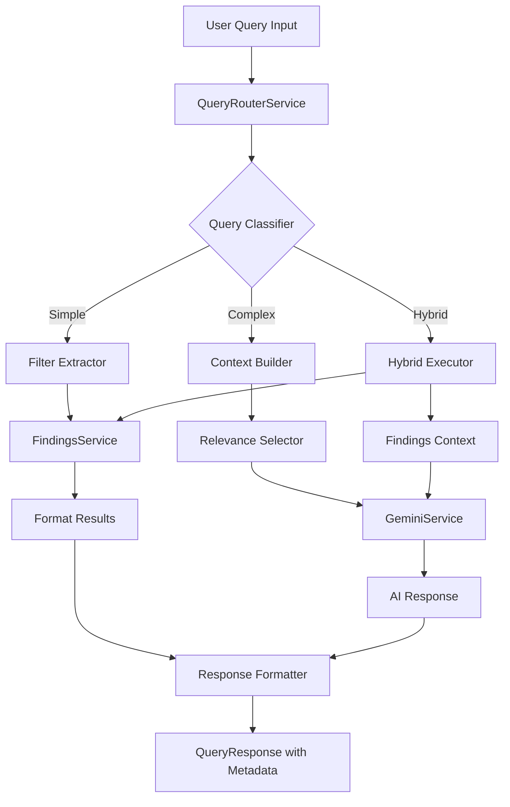

# Smart Query Router - Design Document

## Overview

The Smart Query Router is an intelligent middleware layer that sits between the user's natural language queries and the FIRST-AID system's data retrieval mechanisms. It analyzes incoming queries to determine the optimal execution strategy, balancing response speed, accuracy, and API costs.

The system implements a three-tier routing strategy:
1. **Simple Queries** → Direct Firestore queries (fast, cheap)
2. **Complex Queries** → AI analysis with RAG context (comprehensive, higher cost)
3. **Hybrid Queries** → Database retrieval followed by AI analysis (balanced approach)

## Architecture



## Components and Interfaces

### 1. QueryRouterService

The main orchestrator that coordinates query classification, execution, and response formatting.

```typescript
interface QueryRouterService {
  /**
   * Main entry point - routes query to appropriate handler
   */
  routeQuery(userQuery: string, options?: QueryOptions): Promise<QueryResponse>;
  
  /**
   * Get query classification without executing
   */
  classifyQuery(userQuery: string): Promise<QueryIntent>;
  
  /**
   * Execute with specific query type (override classification)
   */
  executeAs(userQuery: string, queryType: QueryType): Promise<QueryResponse>;
}

interface QueryOptions {
  thinkingMode?: 'low' | 'high';
  maxResults?: number;
  includeMetadata?: boolean;
  sessionId?: string;
}
```

### 2. QueryClassifier

Analyzes natural language queries to determine type and extract structured information.

```typescript
interface QueryClassifier {
  /**
   * Classify query and extract intent
   */
  classify(query: string): Promise<QueryIntent>;
  
  /**
   * Check if query matches simple patterns
   */
  isSimpleQuery(query: string): boolean;
  
  /**
   * Check if query requires AI analysis
   */
  requiresAIAnalysis(query: string): boolean;
}

interface QueryIntent {
  type: 'simple' | 'complex' | 'hybrid';
  confidence: number; // 0-1
  extractedFilters: ExtractedFilters;
  requiresAI: boolean;
  analysisKeywords: string[]; // Keywords that triggered complex classification
}

interface ExtractedFilters {
  year?: number;
  projectType?: ProjectType;
  severity?: FindingSeverity[];
  status?: FindingStatus[];
  department?: string;
  keywords?: string[];
  dateRange?: { start?: Date; end?: Date };
}
```

### 3. FilterExtractor

Extracts structured filter parameters from natural language using pattern matching and Gemini function calling.

```typescript
interface FilterExtractor {
  /**
   * Extract filters using pattern matching (fast, no API cost)
   */
  extractWithPatterns(query: string): ExtractedFilters;
  
  /**
   * Extract filters using Gemini function calling (more accurate)
   */
  extractWithAI(query: string): Promise<ExtractedFilters>;
  
  /**
   * Validate extracted filters against schema
   */
  validateFilters(filters: ExtractedFilters): ValidationResult;
}

interface ValidationResult {
  valid: boolean;
  errors: string[];
  sanitizedFilters: ExtractedFilters;
}
```

### 4. ContextBuilder

Selects and formats relevant findings for AI context injection.

```typescript
interface ContextBuilder {
  /**
   * Build context from findings for AI analysis
   */
  buildContext(findings: Finding[], maxTokens: number): string;
  
  /**
   * Select most relevant findings based on query
   */
  selectRelevantFindings(
    allFindings: Finding[],
    filters: ExtractedFilters,
    maxCount: number
  ): Finding[];
  
  /**
   * Estimate token count for context
   */
  estimateTokens(context: string): number;
}
```

### 5. ResponseFormatter

Formats query results with metadata for consistent output.

```typescript
interface ResponseFormatter {
  /**
   * Format simple query results
   */
  formatSimpleResults(findings: Finding[], metadata: QueryMetadata): QueryResponse;
  
  /**
   * Format AI analysis response
   */
  formatAIResponse(aiResponse: string, findings: Finding[], metadata: QueryMetadata): QueryResponse;
  
  /**
   * Format hybrid response with both data and analysis
   */
  formatHybridResponse(
    findings: Finding[],
    aiAnalysis: string,
    metadata: QueryMetadata
  ): QueryResponse;
}

interface QueryResponse {
  type: 'simple' | 'complex' | 'hybrid';
  answer: string;
  findings?: FindingSummary[];
  metadata: QueryMetadata;
}

interface QueryMetadata {
  queryType: 'simple' | 'complex' | 'hybrid';
  executionTimeMs: number;
  findingsAnalyzed: number;
  tokensUsed?: number;
  confidence: number;
  extractedFilters: ExtractedFilters;
}

interface FindingSummary {
  id: string;
  title: string;
  severity: FindingSeverity;
  status: FindingStatus;
  projectType: ProjectType;
  year: number;
}
```

## Data Models

### Query Classification Patterns

```typescript
// Simple query indicators (regex patterns)
const SIMPLE_PATTERNS = [
  /\b(show|list|find|get)\b.*\b(findings?|issues?|problems?)\b/i,
  /\bhow many\b.*\bfindings?\b/i,
  /\b(in|from|during)\s+\d{4}\b/i,
  /\b(critical|high|medium|low)\s+(priority|severity|findings?)\b/i,
  /\b(open|closed|in progress|deferred)\s+(findings?|status)\b/i,
];

// Complex query indicators (regex patterns)
const COMPLEX_PATTERNS = [
  /\b(what|why|how)\s+should\b/i,
  /\b(recommend|suggest|advise)\b/i,
  /\b(analyze|analysis|patterns?|trends?)\b/i,
  /\b(compare|comparison|versus|vs)\b/i,
  /\b(predict|forecast|anticipate|expect)\b/i,
  /\b(prioritize|priority|important|focus)\b/i,
  /\bbased on\b.*\b(findings?|data|history)\b/i,
];

// Hybrid query indicators
const HYBRID_PATTERNS = [
  /\b(show|list|find)\b.*\b(and|then)\b.*\b(explain|analyze|summarize)\b/i,
  /\b(findings?)\b.*\b(what|why|how)\b/i,
];
```

### Filter Mapping Tables

```typescript
// Project type aliases
const PROJECT_TYPE_ALIASES: Record<string, ProjectType> = {
  'hotel': 'Hotel',
  'hotels': 'Hotel',
  'apartment': 'Apartment',
  'apartments': 'Apartment',
  'flat': 'Apartment',
  'flats': 'Apartment',
  'hospital': 'Hospital',
  'hospitals': 'Hospital',
  'clinic': 'Clinic',
  'clinics': 'Clinic',
  'school': 'School',
  'schools': 'School',
  'university': 'University',
  'universities': 'University',
  'college': 'University',
  'mall': 'Mall',
  'malls': 'Mall',
  'shopping center': 'Mall',
  'office': 'Office Building',
  'office building': 'Office Building',
  'landed house': 'Landed House',
  'house': 'Landed House',
  'houses': 'Landed House',
  'insurance': 'Insurance',
  'mixed-use': 'Mixed-Use Development',
  'mixed use': 'Mixed-Use Development',
};

// Severity aliases
const SEVERITY_ALIASES: Record<string, FindingSeverity> = {
  'critical': 'Critical',
  'urgent': 'Critical',
  'severe': 'Critical',
  'high': 'High',
  'important': 'High',
  'medium': 'Medium',
  'moderate': 'Medium',
  'low': 'Low',
  'minor': 'Low',
};

// Status aliases
const STATUS_ALIASES: Record<string, FindingStatus> = {
  'open': 'Open',
  'pending': 'Open',
  'new': 'Open',
  'in progress': 'In Progress',
  'ongoing': 'In Progress',
  'working': 'In Progress',
  'closed': 'Closed',
  'resolved': 'Closed',
  'done': 'Closed',
  'completed': 'Closed',
  'deferred': 'Deferred',
  'postponed': 'Deferred',
  'delayed': 'Deferred',
};
```

### Gemini Function Calling Schema

```typescript
// Tool definition for Gemini function calling
const FINDINGS_QUERY_TOOL = {
  name: 'query_findings',
  description: 'Search the findings database with structured filters extracted from user query',
  parameters: {
    type: 'object',
    properties: {
      year: {
        type: 'number',
        description: 'The audit year to filter by (e.g., 2024)',
      },
      projectType: {
        type: 'string',
        enum: ['Hotel', 'Landed House', 'Apartment', 'School', 'University', 
               'Insurance', 'Hospital', 'Clinic', 'Mall', 'Office Building', 
               'Mixed-Use Development'],
        description: 'The type of project to filter by',
      },
      severity: {
        type: 'array',
        items: { type: 'string', enum: ['Critical', 'High', 'Medium', 'Low'] },
        description: 'Severity levels to include',
      },
      status: {
        type: 'array',
        items: { type: 'string', enum: ['Open', 'In Progress', 'Closed', 'Deferred'] },
        description: 'Status values to include',
      },
      keywords: {
        type: 'array',
        items: { type: 'string' },
        description: 'Keywords to search in finding titles and descriptions',
      },
      department: {
        type: 'string',
        description: 'Department to filter by',
      },
    },
  },
};
```


## Correctness Properties

*A property is a characteristic or behavior that should hold true across all valid executions of a system-essentially, a formal statement about what the system should do. Properties serve as the bridge between human-readable specifications and machine-verifiable correctness guarantees.*

Based on the acceptance criteria analysis, the following correctness properties must be validated through property-based testing:

### Property 1: Simple query classification for filterable-only queries
*For any* query string containing only filterable field references (year, severity, project type, status, department) and no analytical keywords, the QueryClassifier SHALL return a QueryIntent with type "simple".

**Validates: Requirements 1.1**

### Property 2: Complex query classification for analytical queries
*For any* query string containing analytical keywords (recommend, analyze, compare, why, what should, patterns, trends), the QueryClassifier SHALL return a QueryIntent with type "complex".

**Validates: Requirements 1.2**

### Property 3: Confidence score bounds invariant
*For any* query string processed by the QueryClassifier, the returned QueryIntent SHALL have a confidence score in the range [0, 1] inclusive.

**Validates: Requirements 1.4**

### Property 4: Low confidence fallback to complex
*For any* QueryIntent with confidence below 0.6, the final query type used for execution SHALL be "complex".

**Validates: Requirements 1.5**

### Property 5: Year extraction from queries
*For any* query string containing a 4-digit year (2000-2099) or relative year reference ("last year", "this year"), the FilterExtractor SHALL extract the corresponding year value in the extractedFilters.

**Validates: Requirements 2.1**

### Property 6: Project type extraction and mapping
*For any* query string containing a project type term or alias (hotel, apartment, hospital, etc.), the FilterExtractor SHALL extract and map it to a valid ProjectType enum value.

**Validates: Requirements 2.2**

### Property 7: Severity alias mapping correctness
*For any* severity alias term (critical, urgent, high, important, medium, moderate, low, minor), the FilterExtractor SHALL map it to the corresponding valid FindingSeverity enum value.

**Validates: Requirements 2.3**

### Property 8: Status alias mapping correctness
*For any* status alias term (open, pending, closed, resolved, in progress, ongoing, deferred, postponed), the FilterExtractor SHALL map it to the corresponding valid FindingStatus enum value.

**Validates: Requirements 2.5**

### Property 9: Extracted filters schema validity
*For any* ExtractedFilters object produced by the FilterExtractor, all field values SHALL pass validation against the Finding schema constraints.

**Validates: Requirements 2.6**

### Property 10: Simple query response formatting completeness
*For any* Finding object, when formatted for simple query response, the output SHALL contain the finding's title, severity, status, and dateIdentified.

**Validates: Requirements 3.3**

### Property 11: Pagination for large result sets
*For any* simple query result set with more than 50 findings, the QueryResponse SHALL include pagination metadata with totalCount and indicate that results are paginated.

**Validates: Requirements 3.5**

### Property 12: Context finding count limit
*For any* complex query execution, the number of findings passed as context to GeminiService SHALL NOT exceed 20.

**Validates: Requirements 4.2**

### Property 13: Complex query response includes finding references
*For any* complex query response where findings were used as context, the response SHALL include references to the source findings used in the analysis.

**Validates: Requirements 4.5**

### Property 14: Hybrid query response structure separation
*For any* hybrid query response, the QueryResponse SHALL contain distinct sections for data results (findings list) and AI analysis (answer text).

**Validates: Requirements 5.3**

### Property 15: Response metadata completeness
*For any* QueryResponse returned by the QueryRouter, the metadata SHALL include queryType, executionTimeMs, and findingsAnalyzed fields with valid values.

**Validates: Requirements 6.1, 6.2, 6.3**

### Property 16: Token usage metadata for AI queries
*For any* QueryResponse from a complex or hybrid query, the metadata SHALL include tokensUsed field with a non-negative integer value.

**Validates: Requirements 6.4**

### Property 17: Context token limit enforcement
*For any* context string built for AI analysis, the estimated token count SHALL NOT exceed 10,000 tokens.

**Validates: Requirements 7.1**

### Property 18: Relevance-based finding selection
*For any* set of findings selected for context injection, the selected findings SHALL have higher relevance scores (based on filter match) than non-selected findings from the same query.

**Validates: Requirements 7.4**

### Property 19: QueryIntent serialization round-trip
*For any* valid QueryIntent object, serializing to JSON and deserializing back SHALL produce an equivalent QueryIntent with all fields preserved (type, confidence, extractedFilters).

**Validates: Requirements 9.1, 9.2, 9.3**

### Property 20: QueryIntent deserialization validation
*For any* JSON string that does not conform to the QueryIntent schema, deserialization SHALL fail with a validation error rather than producing an invalid object.

**Validates: Requirements 9.4**

## Error Handling

### Classification Errors
- If pattern matching fails or throws an exception, default to "complex" type with confidence 0.5
- Log the error with query details for debugging

### Database Errors
- Wrap all Firestore operations in try-catch
- Return user-friendly error message: "Unable to search findings. Please try again."
- Include retry suggestion in response

### AI Service Errors
- If GeminiService throws an error, fall back to returning raw database results
- Include explanation: "AI analysis unavailable. Showing database results only."
- For quota exceeded errors, suggest using simple queries

### Validation Errors
- If extracted filters fail validation, log the invalid values
- Proceed with valid filters only, ignoring invalid ones
- Include warning in response metadata

```typescript
interface ErrorResponse {
  success: false;
  error: {
    code: 'CLASSIFICATION_ERROR' | 'DATABASE_ERROR' | 'AI_ERROR' | 'VALIDATION_ERROR' | 'RATE_LIMIT_ERROR';
    message: string;
    suggestion?: string;
    fallbackData?: Finding[];
  };
  metadata: QueryMetadata;
}
```

## Testing Strategy

### Dual Testing Approach

This feature requires both unit tests and property-based tests to ensure comprehensive coverage:

#### Unit Tests
- Test specific query examples for each classification type
- Test edge cases (empty queries, very long queries, special characters)
- Test error handling paths
- Test integration with FindingsService and GeminiService

#### Property-Based Tests

**Library:** fast-check (TypeScript property-based testing library)

**Configuration:** Each property test SHALL run a minimum of 100 iterations.

**Test Annotation Format:** Each property-based test SHALL be tagged with:
`**Feature: smart-query-router, Property {number}: {property_text}**`

### Test Categories

1. **Classification Properties (Properties 1-4)**
   - Generate random queries with controlled characteristics
   - Verify classification behavior matches requirements

2. **Filter Extraction Properties (Properties 5-9)**
   - Generate queries with known filter values embedded
   - Verify extraction accuracy and mapping correctness

3. **Response Formatting Properties (Properties 10-11, 14-16)**
   - Generate random findings and query results
   - Verify response structure and completeness

4. **Context Management Properties (Properties 12-13, 17-18)**
   - Generate varying numbers of findings
   - Verify limits and relevance selection

5. **Serialization Properties (Properties 19-20)**
   - Generate random QueryIntent objects
   - Verify round-trip consistency and validation

### Test Generators

```typescript
// Generator for simple queries
const simpleQueryArb = fc.record({
  year: fc.integer({ min: 2020, max: 2025 }),
  projectType: fc.constantFrom(...PROJECT_TYPES),
  severity: fc.constantFrom(...SEVERITIES),
}).map(({ year, projectType, severity }) => 
  `Show ${severity} findings in ${projectType} from ${year}`
);

// Generator for complex queries
const complexQueryArb = fc.record({
  analyticalKeyword: fc.constantFrom('recommend', 'analyze', 'compare', 'why', 'patterns'),
  topic: fc.constantFrom('safety', 'compliance', 'risk', 'findings'),
}).map(({ analyticalKeyword, topic }) =>
  `${analyticalKeyword} ${topic} trends based on historical data`
);

// Generator for QueryIntent
const queryIntentArb = fc.record({
  type: fc.constantFrom('simple', 'complex', 'hybrid'),
  confidence: fc.float({ min: 0, max: 1 }),
  extractedFilters: extractedFiltersArb,
  requiresAI: fc.boolean(),
  analysisKeywords: fc.array(fc.string(), { maxLength: 5 }),
});
```

### Integration Test Scenarios

1. End-to-end simple query flow
2. End-to-end complex query flow with mocked GeminiService
3. End-to-end hybrid query flow
4. Error recovery scenarios
5. Rate limiting behavior
