# Firebase Query Flow Diagram

## Overview

This document provides visual diagrams showing how Firebase queries flow through the FIRST-AID system, from user input to database results.

---

## 1. Basic Query Flow

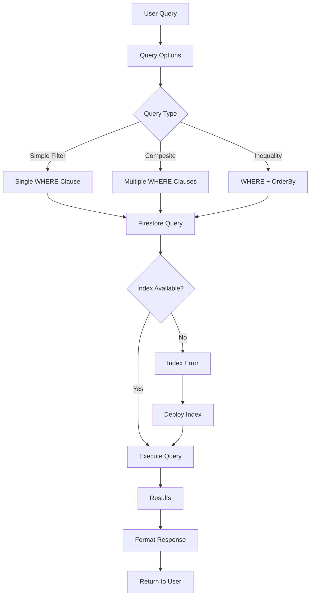

---

## 2. DocAI Query Processing Flow

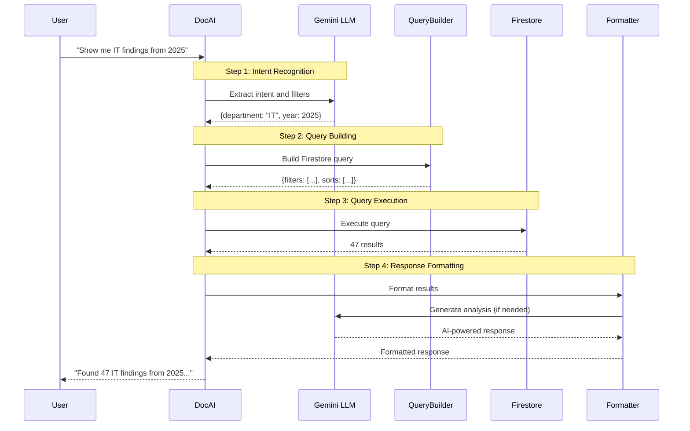

---

## 3. Query Type Decision Tree

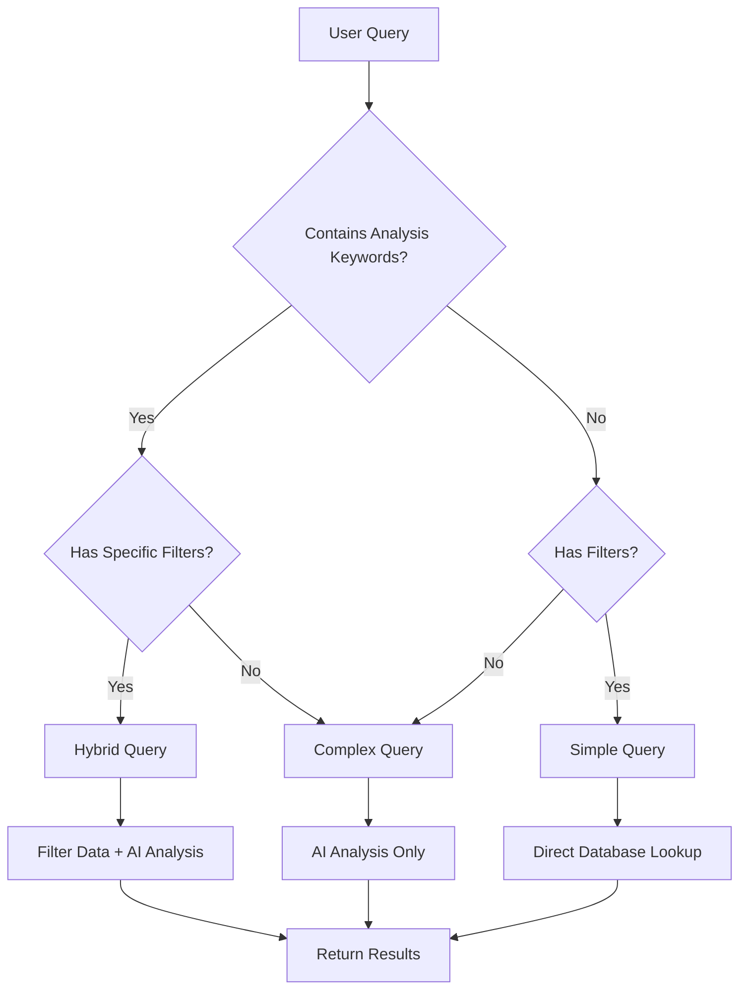

**Analysis Keywords**: recommend, suggest, analyze, compare, pattern, trend, predict, prioritize, insight, improve, summary, explain, why, how should

---

## 4. Composite Index Resolution

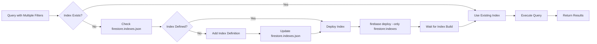

---

## 5. Query Optimization Flow

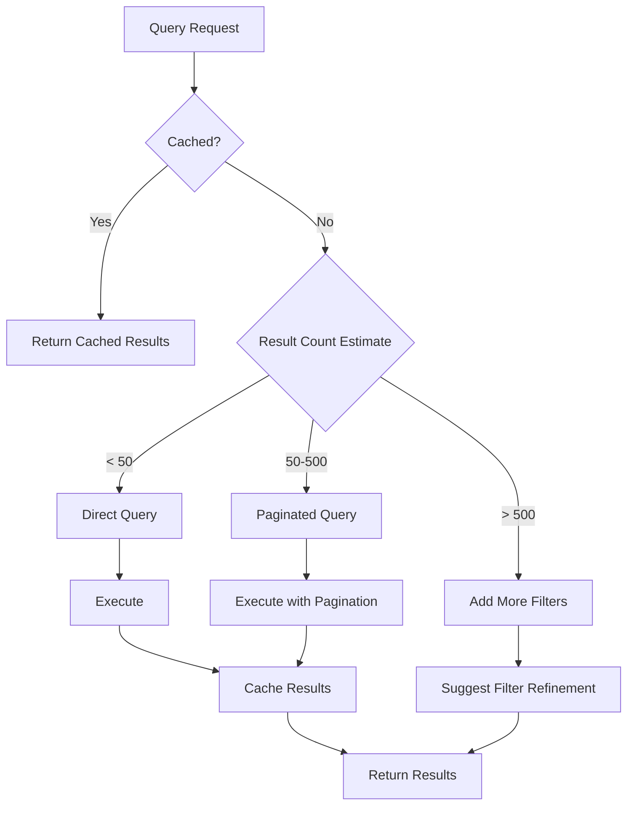

---

## 6. Error Handling Flow

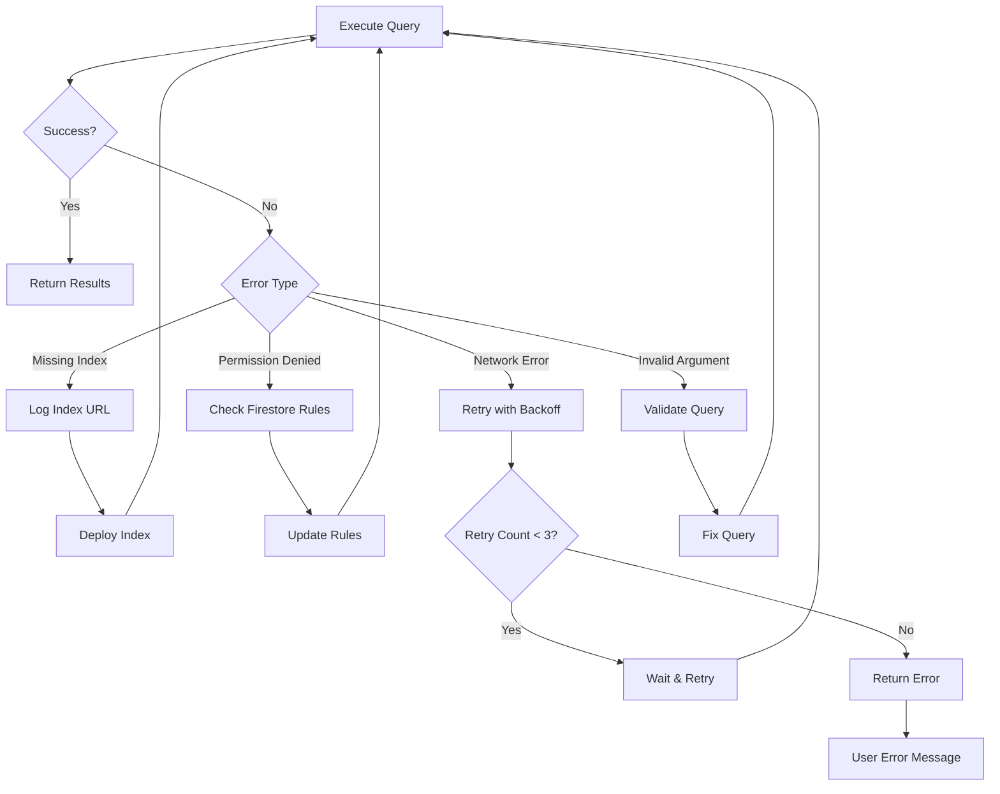

---

## 7. Data Flow Architecture

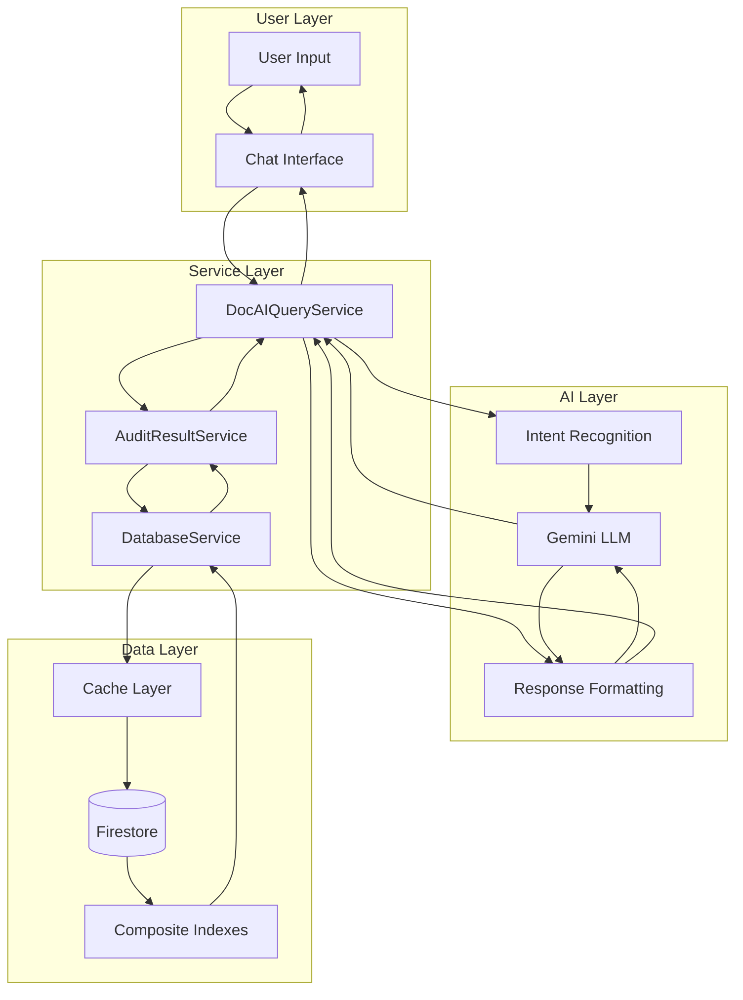

---

## 8. Query Template Matching

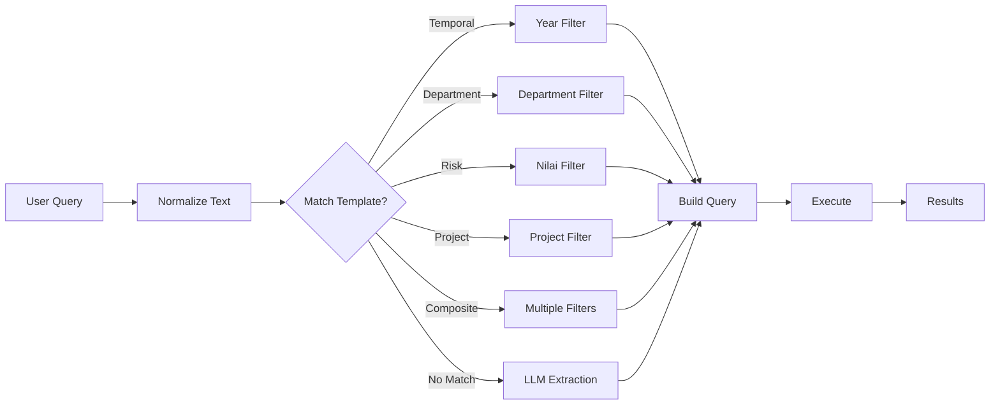

---

## 9. Real-Time Query Example

### Example: "Show me critical IT findings from 2025"

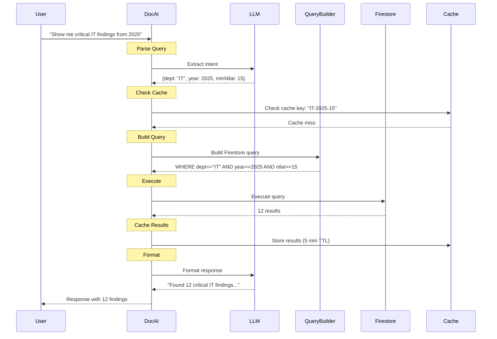

**Performance**:
- Cache check: 5ms
- LLM extraction: 800ms
- Query execution: 150ms
- Response formatting: 1200ms
- **Total**: ~2.2 seconds

---

## 10. Index Strategy Diagram

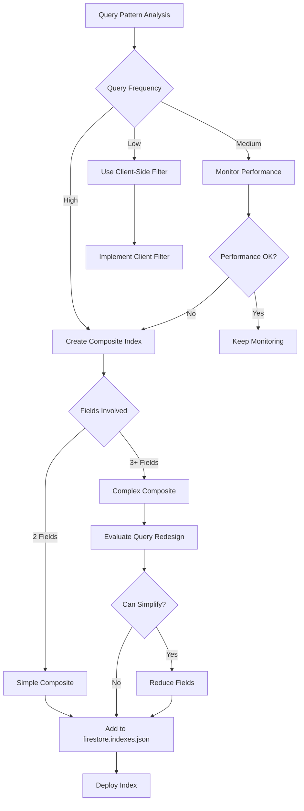

---

## Query Performance Comparison

### Simple Query (1 Filter)
```
User Query → Intent (800ms) → Query (150ms) → Format (200ms)
Total: ~1.2s
```

### Composite Query (2 Filters)
```
User Query → Intent (800ms) → Query (200ms) → Format (200ms)
Total: ~1.2s
```

### Complex Query (AI Analysis)
```
User Query → Intent (800ms) → Query (150ms) → AI Analysis (2000ms) → Format (500ms)
Total: ~3.5s
```

### Hybrid Query (Filter + AI)
```
User Query → Intent (800ms) → Query (200ms) → AI Analysis (2000ms) → Format (500ms)
Total: ~3.5s
```

---

## Best Practices Summary

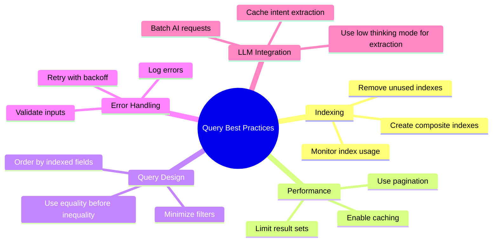

---

## Related Documentation

- [Firebase Query Guide](./firebase-query-guide.md) - Complete query reference
- [Firebase Query Summary](./firebase-query-guide-summary.md) - Quick reference
- [DocAI Integration](./DOCAI-README-2-TABLE.md) - DocAI system overview
- [Smart Query Router](./smart-query-router-v2-integration.md) - Query routing logic

---

**Last Updated**: December 8, 2025  
**Version**: 1.0.0
